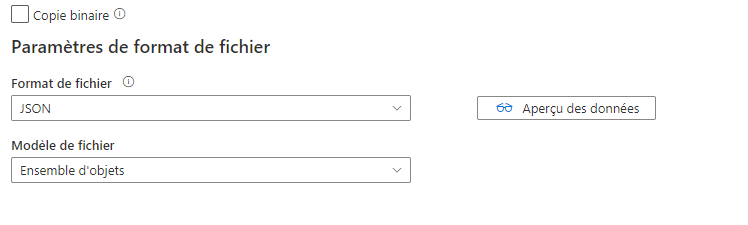
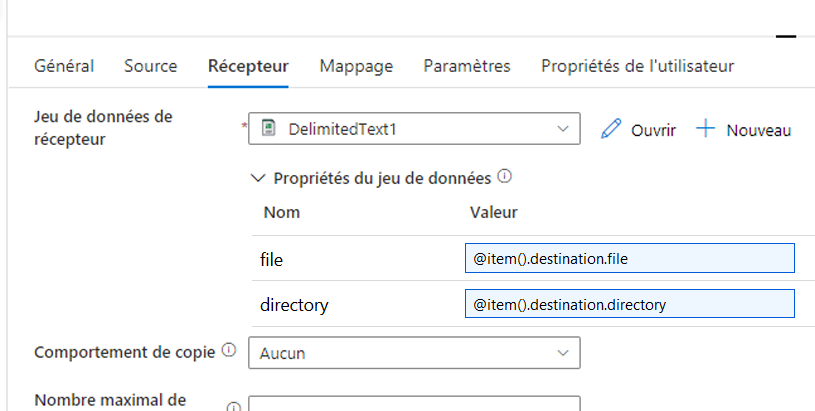
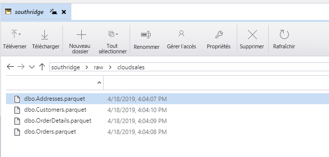
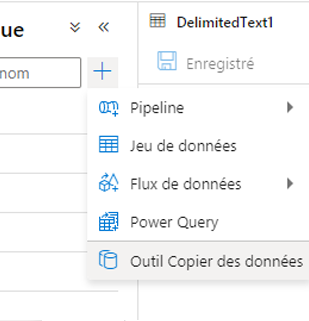

## <a name="challenge-2-lights-camera-action"></a>Défi 2 : Lumières, caméra, action

Le deuxième défi consiste à extraire les premières données Southridge des bases de données Azure SQL et d’une collection Cosmos DB.
L’objectif de ce défi est de rendre l’équipe opérationnelle avec une solution de déplacement de données. La solution recommandée consiste à utiliser [Azure Data Factory](https://docs.microsoft.com/en-us/azure/data-factory/) pour copier les données des systèmes sources dans le lac de données **telles quelles**, autrement dit avec **le moins possible de transformation, de nettoyage ou de traitement**.

> REMARQUE : Même dans ce défi, nous pouvons déjà commencer à voir les avantages de la centralisation des données dans un lac de données d’entreprise.
Même si toutes les données de ce défi sont dans Azure, il y a un mélange de données relationnelles dans Azure SQL et de données non relationnelles stockées au format JSON dans une collection de documents Cosmos DB.

### <a name="creating-an-azure-data-factory"></a>Création d’une ressource Azure Data Factory

Les [démarrages rapides](https://docs.microsoft.com/en-us/azure/data-factory/#5-minute-quickstarts) de la [documentation du produit](https://docs.microsoft.com/en-us/azure/data-factory/) contiennent tous les détails pour créer la ressource Azure Data Factory via le [portail Azure](https://docs.microsoft.com/en-us/azure/data-factory/quickstart-create-data-factory-portal#create-a-data-factory) ou [PowerShell](https://docs.microsoft.com/en-us/azure/data-factory/quickstart-create-data-factory-powershell#create-a-data-factory).

> REMARQUE : Les démarrages rapides associés ci-dessus contiennent des informations supplémentaires sur la création de pipelines dans Data Factory. Dans le cadre de cette section de la solution OpenHack, reportez-vous uniquement à la section « Créer une fabrique de données » du démarrage rapide.

### <a name="extracting-the-sales-streaming-and-catalog-data-into-the-data-lake"></a>Extraction des données de vente, de streaming et de catalogue dans le lac de données

Globalement, les étapes requises sont

1. Définir les services liés et les jeux de données sources pour les bases de données Azure SQL
1. Définir un service lié et un jeu de données source pour la collection Cosmos DB
1. Définir un service lié et des jeux de données de récepteur pour le compte de stockage ADLS Gen 2
1. Créer des pipelines qui copient les données des sources vers les récepteurs

#### <a name="defining-the-cosmos-db-linked-service-and-source-dataset"></a>Définition du service lié Cosmos DB et du jeu de données source

À partir de l’expérience de création de la ressource Data Factory, ajoutez un nouveau jeu de données.


Choisissez le magasin de données Azure Cosmos DB (API SQL), puis continuez.


Sous l’onglet Connexion de la fenêtre des propriétés du jeu de données, cliquez sur Nouveau pour créer un service lié.


Le chemin le plus simple consiste à sélectionner le compte et la base de données Cosmos DB dans les listes déroulantes fournies, puis à cliquer sur Terminer.


Sélectionnez la collection Movies. Il n’est **pas nécessaire** d’afficher un aperçu des données ou d’importer un schéma sous l’onglet Schéma. En fait, la solution est plus facile si ces éléments sont ignorés. Apportez plutôt les données de catalogue dans le lac de données **telles quelles**.


Vous pouvez éventuellement valider et publier à ce stade pour créer un « point de contrôle » de la progression, mais notez que le jeu de données n’est encore utilisé nulle part.

#### <a name="defining-the-azure-sql-linked-services-and-source-datasets"></a>Définition des services liés et des jeux de données sources Azure SQL

À partir de l’expérience de création de la ressource Data Factory, ajoutez un nouveau jeu de données.


Choisissez Azure SQL Database, puis Continuer.


Sous l’onglet Connexion, cliquez sur « Nouveau » pour créer un service lié.
Le chemin le plus simple consiste à utiliser les listes déroulantes pour sélectionner la ressource Azure cible. Fournissez également les informations d’authentification, puis cliquez sur « Terminer ».


Au lieu de coder en dur un nom de table, il est avantageux de le paramétrer pour le réutiliser. Accédez à l’onglet Paramètres et cliquez sur « Nouveau » pour ajouter un paramètre de nom de table.


Le paramètre peut ensuite être utilisé pour ajouter du contenu dynamique sous l’onglet Connexion.

> REMARQUE : Cette capture d’écran montre l’emplacement et le style de l’option « Ajouter du contenu dynamique », mais dans le contexte d’un chemin de fichier. Le même concept s’applique à la propriété « Table » de la connexion du jeu de données Azure SQL.
Notez également que l’option « Ajouter du contenu dynamique » peut ne pas apparaître, sauf si vous avez cliqué sur le bouton « Modifier » sous la propriété « Table » pour convertir la liste déroulante en zone de texte.


> REMARQUE : Répétez cette procédure pour définir un jeu de données pour l’autre base de données Azure SQL de Southridge. Les deux bases de données du serveur logique sont CloudSales et CloudStreaming.

Ensuite, vous pouvez éventuellement valider et publier tout pour avoir un « point de contrôle » de la progression.

#### <a name="defining-the-adls-gen-2-linked-service-and-sink-datasets"></a>Définition des jeux de données de récepteur et du service lié ADLS Gen 2

À partir de l’expérience de création de la ressource Data Factory, ajoutez un nouveau jeu de données.


Choisissez Azure Data Lake Storage Gen2, puis Continuer.


Sous l’onglet Connexion, cliquez sur « Nouveau » pour créer un service lié.
Le chemin le plus simple consiste à utiliser les listes déroulantes pour sélectionner la ressource Azure cible. Cliquez ensuite sur « Terminer ».


Pour faciliter la réutilisation de ce jeu de données, accédez à l’onglet Paramètres et définissez les paramètres `directory` et `file`. Ils seront utilisés dans la prochaine section.


De retour sous l’onglet Connexion, utilisez ces paramètres comme chemin de fichier de sortie en spécifiant `@dataset().directory` comme répertoire et `@dataset().file` comme fichier.

> REMARQUE : Vous devez utiliser la fonctionnalité « Ajouter du contenu dynamique » pour fournir ces valeurs paramétrisées.


Sous l’onglet Connexion de la fenêtre des propriétés, choisissez d’utiliser le « Format JSON » avec le modèle « Ensemble d’objets ».
Lorsque les données sont stockées, chaque ligne du fichier de sortie est un objet JSON unique du jeu de données source.
Notez que cela signifie que le fichier de sortie lui-même ne sera pas un JSON valide, mais chaque ligne du fichier oui.



Vous pouvez éventuellement valider et publier à ce stade pour créer un « point de contrôle » de la progression, mais notez que le jeu de données n’est encore utilisé nulle part.

> REMARQUE : Répétez cette procédure, mais au lieu de choisir le format de fichier JSON, choisissez un format texte (CSV) ou parquet.
Deux jeux de données ADLS Gen2 seront alors disponibles, l’un pour stocker les données sous la forme d’un ensemble d’objets JSON, et l’autre pour les stocker dans un format texte (CSV) ou parquet.

#### <a name="creating-a-pipeline-to-copy-the-cosmos-db-movies-collection"></a>Création d’un pipeline pour copier la collection Movies Cosmos DB

À partir de l’expérience de création de la ressource Data Factory, ajoutez un nouveau pipeline.


Faites glisser une tâche « Copier des données » sur l’aire de conception.


Sous l’onglet Source, sélectionnez le jeu de données Cosmos DB créé dans les étapes précédentes.


Sous l’onglet Récepteur, choisissez le jeu de données **JSON** ADLS Gen2 dans les étapes précédentes.
Notez que les paramètres définis sur ce jeu de données sont maintenant disponibles dans les propriétés du jeu de données de récepteur.
Spécifiez un répertoire de sortie et un nom de fichier.


Publiez le pipeline et déclenchez-le.


Vérifiez que les données existent dans le lac de données à l’emplacement cible.
Pour ce faire, vous pouvez utiliser l’[Explorateur Stockage Azure](https://azure.microsoft.com/en-us/features/storage-explorer/).


Le fichier doit contenir 1 047 objets de film, dont les trois premiers devraient ressembler à ceci :

```json
{"actors":[{"name":"Eric Ray"},{"name":"Danielle Busey"},{"name":"Priscilla Wayne"}],"availabilityDate":"2017-03-14 00:00:00","genre":"Science Fiction","rating":"PG-13","releaseYear":1935,"runtime":162,"streamingAvailabilityDate":"2017-06-06 00:00:00","tier":1,"title":"Happy Theater","id":"9248bacc-4d5c-4758-a250-4002bd645482","_rid":"G4YpAJvRCE8BAAAAAAAAAA==","_self":"dbs/G4YpAA==/colls/G4YpAJvRCE8=/docs/G4YpAJvRCE8BAAAAAAAAAA==/","_etag":"\"00003c07-0000-0100-0000-5cb7b3720000\"","_attachments":"attachments/","_ts":1555542898}
{"actors":[{"name":"Jack Smith"},{"name":"Freida Pine"}],"availabilityDate":"2017-01-31 00:00:00","genre":"Romance","rating":"R","releaseYear":1965,"runtime":100,"streamingAvailabilityDate":"2017-03-28 00:00:00","tier":2,"title":"The Theater of Adventure","id":"10adb54b-ac9c-4a8b-a921-f9bd8ecb3988","_rid":"G4YpAJvRCE8CAAAAAAAAAA==","_self":"dbs/G4YpAA==/colls/G4YpAJvRCE8=/docs/G4YpAJvRCE8CAAAAAAAAAA==/","_etag":"\"00003d07-0000-0100-0000-5cb7b3720000\"","_attachments":"attachments/","_ts":1555542898}
{"actors":[{"name":"Thomas Carter"},{"name":"Eric Smith"}],"availabilityDate":"2018-05-22 00:00:00","genre":"Action/Adventure","rating":"R","releaseYear":1921,"runtime":143,"streamingAvailabilityDate":"2018-07-17 00:00:00","tier":2,"title":"The Book of Intrigue","id":"ee607719-e868-4d21-bead-54d796d8fec0","_rid":"G4YpAJvRCE8DAAAAAAAAAA==","_self":"dbs/G4YpAA==/colls/G4YpAJvRCE8=/docs/G4YpAJvRCE8DAAAAAAAAAA==/","_etag":"\"00003e07-0000-0100-0000-5cb7b3720000\"","_attachments":"attachments/","_ts":1555542898}
```

> REMARQUE : En apportant le contenu « tel quel », on trouve un certain nombre de métadonnées inutiles comme _rid, _self, _etag, _attachments et _ts.
Dans les scénarios de production avec de grands jeux de données, il est important de prendre en compte les inconvénients de l’intégration de ces données dans le lac.
Dans le cadre de l’OpenHack et avec la taille et l’échelle de ce catalogue de films, cette approche est recommandée pour réduire les frottements dans le traitement du tableau des acteurs.

#### <a name="creating-a-pipeline-to-extract-azure-sql-data"></a>Création d’un pipeline pour extraire les données Azure SQL

À partir de l’expérience de création de la ressource Data Factory, ajoutez un nouveau pipeline.

 Faites glisser une tâche « ForEach » sur l’aire de conception.


Une fois le canevas de pipeline vide sélectionné, ajoutez un paramètre appelé `items` à l’onglet Paramètres. La valeur de ce paramètre n’est pas encore importante, mais elle détermine la phase qui définit sur quoi la tâche ForEach va itérer.


Une fois la tâche ForEach sélectionnée, définissez un paramètre `items` sous l’onglet Paramètres. Affectez la valeur `@pipeline().parameters.items` pour utiliser le paramètre de pipeline défini ci-dessus.


Sous l’onglet Activités, cliquez sur « Modifier les activités » pour ouvrir l’aire de conception interne de la tâche ForEach.


Faites glisser une tâche « Copier des données » sur l’aire de conception.


Configurez la source pour utiliser le jeu de données CloudSales créé précédemment.


> REMARQUE : Le nom de table du jeu de données est défini sur le contenu dynamique de `@item().source.tableName`.
À ce stade du tutoriel, cette propriété `source` pour l’élément n’a pas encore été définie ou fournie dans la collection d’éléments pour la tâche ForEach.
Cela sera défini dans une étape ultérieure.

De même, configurez le récepteur pour qu’il utilise le jeu de données de récepteur texte (CSV) ou parquet précédemment défini.



> Remarque : Le fichier et le répertoire du jeu de données sont définis sur le contenu dynamique depuis `@item().destination`.
À ce stade du tutoriel, cette propriété `destination` pour l’élément n’a pas encore été définie ou fournie dans la collection d’éléments pour la tâche ForEach.
Nous allons la définir maintenant, tout comme `@item().source`.

Accédez à la surface de conception du pipeline et revenez à l’onglet Paramètres, où une propriété `items` n’a pas de valeur fournie.
La valeur est un tableau JSON, où chaque objet du tableau est un élément à traiter par la tâche ForEach.
La structure de chaque objet est définie par l’utilisateur.
Dans la tâche Copier des données, ce tutoriel suppose que chaque élément aura une `source` et une `destination`, et que `source` aura un `tableName` tandis que `destination` aura à la fois `directory` et `file`.

Voici une collection `items` JSON qui fonctionnerait pour la base de données CloudSales.
Elle a été mise en forme dans un souci de lisibilité.

> REMARQUE : Même si ce n’est pas implémenté ci-dessous, il est possible de changer facilement les répertoires de destination de chaque élément.
De cette façon, les données des clients et des adresses peuvent se trouver dans un répertoire avec des listes de contrôle d’accès supplémentaires pour les limiter à ceux qui ont le besoin métier d’accéder aux données client.

```json
[
    {
        "source": {
            "tableName": "[dbo].[Addresses]"
        },
        "destination": {
            "directory": "southridge/raw/cloudsales",
            "file": "dbo.Addresses.parquet"
        }
    },
    {
        "source": {
            "tableName": "[dbo].[Customers]"
        },
        "destination": {
            "directory": "southridge/raw/cloudsales",
            "file": "dbo.Customers.parquet"
        }
    },
    {
        "source": {
            "tableName": "[dbo].[OrderDetails]"
        },
        "destination": {
            "directory": "southridge/raw/cloudsales",
            "file": "dbo.OrderDetails.parquet"
        }
    },
    {
        "source": {
            "tableName": "[dbo].[Orders]"
        },
        "destination": {
            "directory": "southridge/raw/cloudsales",
            "file": "dbo.Orders.parquet"
        }
    }
]
```

Publiez le pipeline et déclenchez-le.


Vérifiez que les données existent dans le lac de données à l’emplacement cible.
Pour ce faire, vous pouvez utiliser l’[Explorateur Stockage Azure](https://azure.microsoft.com/en-us/features/storage-explorer/).



> REMARQUE : Répétez cette procédure pour extraire les données de la base de données CloudStreaming.
Notez qu’Azure Data Factory prend en charge une fonctionnalité « Cloner ».
Après l’utilisation de « Cloner », il suffit d’ajuster le jeu de données source et les détails de la collection `items`.

#### <a name="using-the-copy-data-wizard-to-copy-the-azure-sql-data"></a>Utilisation de l’Assistant Copier des données pour copier les données Azure SQL

> REMARQUE : L’utilisation de l’Assistant Copier des données peut être une très bonne expérience de démarrage rapide, mais elle omet quelques détails sur la façon d’utiliser l’itération ForEach, de définir et de passer les paramètres via le pipeline, etc. Elle donne également des jeux de données avec des noms abstraits. Pour ces raisons, il est recommandé d’utiliser l’Assistant Copier des données juste une fois, puis d’utiliser ses résultats comme guide pour créer un pipeline similaire de toutes pèces.

À partir de l’expérience de création d’une ressource Data Factory, choisissez l’Assistant Copier des données.



Spécifiez la base de données source.


Choisissez les tables à partir du schéma `dbo`.


Choisissez la destination ADLS Gen2.


Spécifiez le dossier de sortie et, éventuellement, modifiez les noms de fichier.

> REMARQUE : Il est recommandé de supprimer les caractères `[` et `]` des noms de fichier.


Choisissez un format de sortie. Le format texte (CSV) ou parquet sont recommandés.


Prenez les Paramètres par défaut et terminez l’Assistant. Le pipeline s’exécute immédiatement et les fichiers de sortie se trouvent dans le lac de données.


