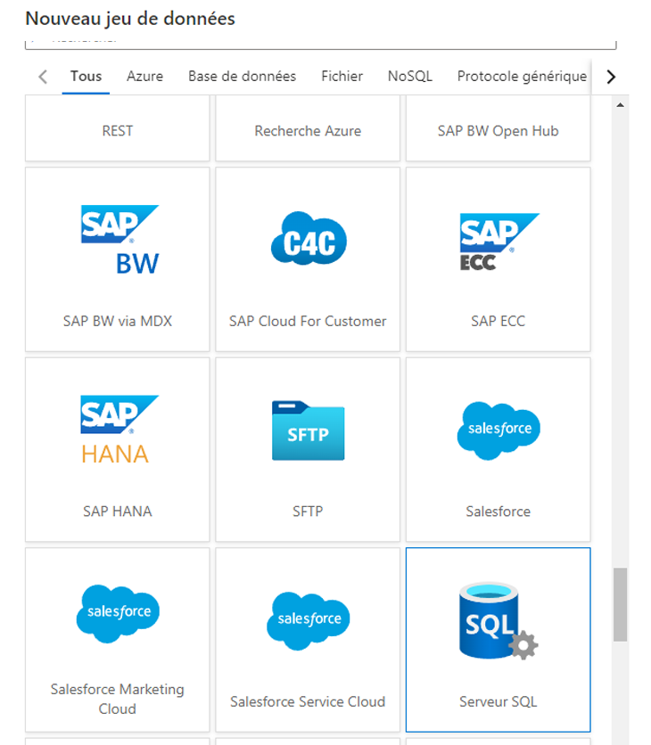
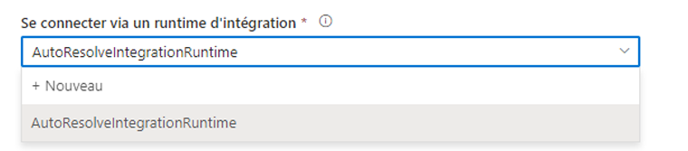
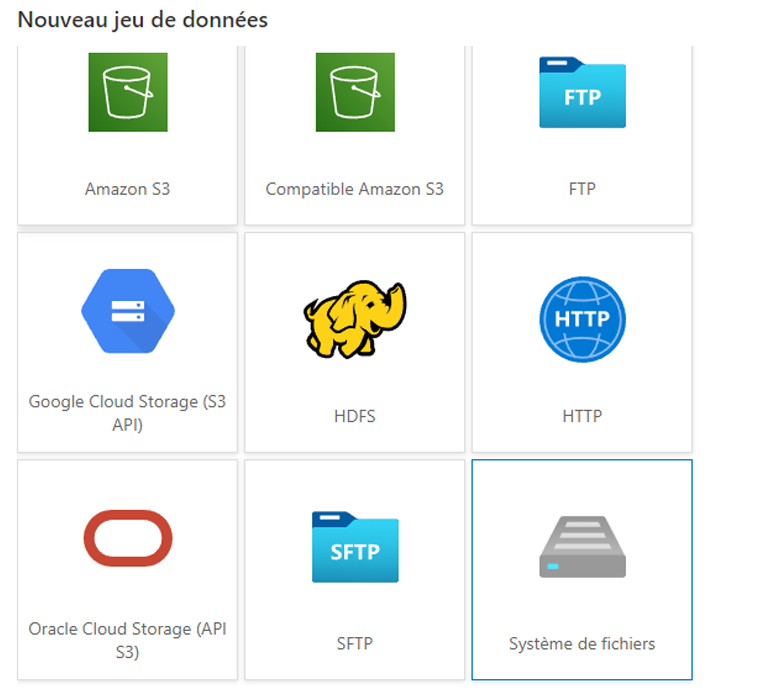
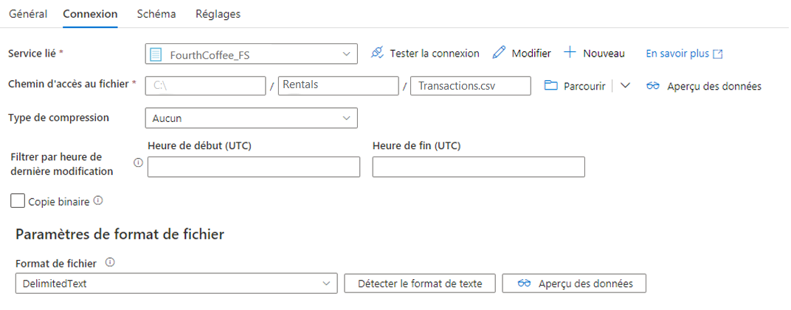
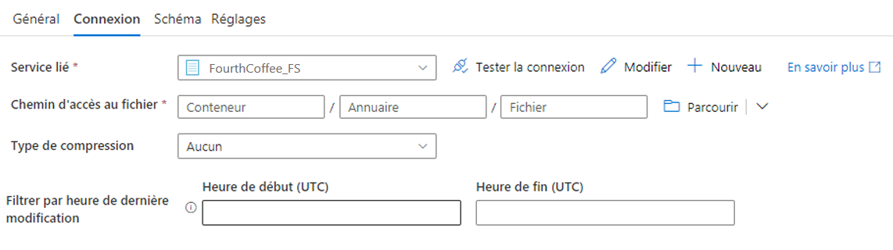

## <a name="challenge-3-breaking-the-fourth-wall"></a>Défi 3 : Briser le quatrième mur

Ce défi porte sur l’incorporation de sources de données supplémentaires dans le lac de données. Alors que les premières données ont été extraites de sources basées sur le cloud, les données de ce défi viennent de magasins de données locaux.

Au cours de ce défi, il peut devenir évident que ces sources utilisent divers types de données et de format. La gestion de cela est l’objet du prochain défi !
Pour le moment, nous restons concentrés sur l’extraction des données dans le lac des données, **de préférence telles quelles**.

> REMARQUE : Pour mettre en place un environnement de labo OpenHack, ces sources « locales » sont modélisées comme machines virtuelles Azure. Suspendez l’incrédulité et imaginez que ces machines virtuelles sont véritablement situées localement avec leurs sociétés fictives respectives (VanArsdel, Ltd. et Fourth Coffee).

### <a name="extracting-vanarsdel-ltd-sql-data"></a>Extraction des données SQL VanArsdel, Ltd.

Le processus est presque identique au travail effectué pour extraire les données de la base de données CloudStreaming de Southridge Video.
La principale différence est que l’instance SQL Server est « locale » (pour les contraintes de ce labo, sur une machine virtuelle Azure), plutôt que dans Azure SQL.

Azure Data Factory prend en charge l’extraction de sources locales via l’installation d’un [Runtime d’intégration auto-hébergé](https://docs.microsoft.com/fr-fr/azure/data-factory/create-self-hosted-integration-runtime#installation-best-practices).

Commencez par ajouter un jeu de données SQL Server.



Lorsque vous créez le nouveau service lié à partir de l’onglet Connexion, choisissez de créer un nouveau runtime d’intégration.



Suivez les invites pour créer un nouveau runtime d’intégration auto-hébergé.
Cela implique l’installation du runtime et l’inscription avec une clé d’authentification une fois l’installation terminée.

Lors de l’utilisation du [format parquet](https://docs.microsoft.com/fr-fr/azure/data-factory/supported-file-formats-and-compression-codecs#parquet-format), il est également nécessaire d’installer JRE 8 (Java Runtime Environment) 64 bits ou OpenJDK sur votre machine de runtime d’intégration.

> REMARQUE : Dans les scénarios de production, le runtime d’intégration auto-hébergé ne doit pas être installé sur le serveur de base de données lui-même.
Sous peine d’implications sur la sécurité et les performances.
Utilisez plutôt une jumpbox.
Dans le cadre d’OpenHack, il est acceptable d’installer le runtime d’intégration auto-hébergé sur les machines virtuelles « locales » fournies.

Une fois que le runtime et le service lié sont établis, le reste de la création du jeu de données et du pipeline est exactement le même que pour les bases de données Azure SQL.
Il est possible de cloner le pipeline qui a copié les données CloudStreaming. Du coup, il suffit juste de modifier la source et la collection `items`.

### <a name="copying-the-fourth-coffee-csv-data"></a>Copie des données CSV de Fourth Coffee

Elle se fait de la même façon, encore une fois.
La différence est qu’un jeu de données de système de fichiers est créé.



Notez que même s’il est recommandé de paramétriser le répertoire et le nom de fichier, comme cela a été fait pour le récepteur ADLS Gen2, la spécification temporaire d’un seul fichier active la fonctionnalité « Détecter le format du texte ».





Vous pouvez aussi choisir la case à cocher « Copie binaire ».
Créez ensuite un autre jeu de données ADLS Gen2 à l’aide du service lié ADLS Gen2 existant, mais en choisissant à nouveau « Copie binaire ».
Utilisez-les comme source et récepteur pour copier les fichiers CSV exactement tels qu’ils sont.

> TODO : La tentative de publication après le clonage et la mise à jour de la source et de `items` aboutit à un échec car l’activité Copier la table nécessite le Type de source. A dû modifier le mode Code pour mettre à jour `typeProperties` avec les éléments suivants :

```json
"source": {
    "type": "FileSystemSource",
    "recursive": true
},
```

### <a name="establishing-source-control"></a>Établissement du contrôle de code source

Azure Data Factory prend en charge l’intégration de Git.
Une autre option consiste à exporter et à valider plus manuellement les modèles ARM depuis Azure Data Factory.
