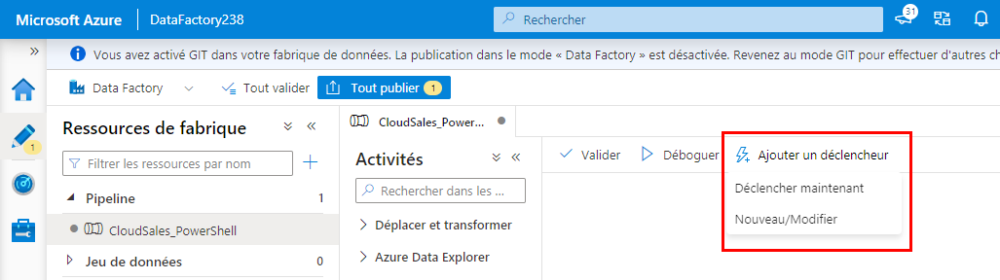

# <a name="creating-pipelines-to-orchestrate-the-data-movement"></a>Création de pipelines pour orchestrer le déplacement des données

Maintenant que vous avez des jeux de données correctement configurés, vous pouvez créer les pipelines qui les utiliseront pour déplacer les données de la source vers le récepteur.

## <a name="01---create-the-pipeline-to-move-the-cloudsales-sql-database"></a>01 - Créer le pipeline pour déplacer la base de données SQL CloudSales

Avec [cette référence](https://docs.microsoft.com/en-us/azure/data-factory/quickstart-create-data-factory-powershell#create-a-pipeline), vous allez créer un pipeline à l’aide de PowerShell.

Créez un fichier appelé `CloudSales-Pipeline.json` avec la structure suivante :

```json
{
    "name": "<pipeline name>",
    "properties": {
        "activities": [
            {
                "name": "ForEach_Table",
                "type": "ForEach",
                "typeProperties": {
                    "items": {
                        "value": "@pipeline().parameters.items",
                        "type": "Expression"
                    },
                    "activities": [
                        {
                            "name": "Copy_Rows",
                            "type": "Copy",
                            "policy": {
                                "timeout": "7.00:00:00",
                                "retry": 0,
                                "retryIntervalInSeconds": 30,
                                "secureOutput": false,
                                "secureInput": false
                            },
                            "typeProperties": {
                                "source": {
                                    "type": "SqlSource"
                                },
                                "sink": {
                                    "type": "AzureBlobFSSink"
                                },
                                "enableStaging": false
                            },
                            "inputs": [
                                {
                                    "referenceName": "<source dataset name>",
                                    "type": "DatasetReference",
                                    "parameters": {
                                        "tableName": "@item().source.tableName"
                                    }
                                }
                            ],
                            "outputs": [
                                {
                                    "referenceName": "<sink dataset name>",
                                    "type": "DatasetReference",
                                    "parameters": {
                                        "tableName": "@item().destination.fileName",
                                        "filePath": "@pipeline().parameters.destinationFolder"
                                    }
                                }
                            ]
                        }
                    ]
                }
            }
        ],
        "parameters": {
            "items": {
                "type": "Array",
                "defaultValue": [
                    {
                        "source": {
                            "tableName": "[dbo].[Table1]"
                        },
                        "destination": {
                            "fileName": "Table1"
                        }
                    },
                    {
                        "source": {
                            "tableName": "[dbo].[Table2]"
                        },
                        "destination": {
                            "fileName": "Table2"
                        }
                    },
                    {
                        "source": {
                            "tableName": "[dbo].[TableN]"
                        },
                        "destination": {
                            "fileName": "TableN"
                        }
                    }
                ]
            },
            "destinationFolder": {
                "type": "String",
                "defaultValue": "<folder name>"
            }
        }
    },
    "type": "Microsoft.DataFactory/factories/pipelines"
}
```

Attention à remplacer les valeurs suivantes :

- `<pipeline name>` : nom de votre pipeline
- `<source dataset name>` : nom du jeu de données source
- `<sink dataset name>` : nom du jeu de données de destination (parquet)
- `parameters:items` : liste des tables à copier dans le récepteur.
Vous remarquez des noms de table comme `[dbo].[Table1]`. Remplacez-les par les noms des tables que vous copiez et ajoutez de nouveaux éléments en fonction des besoins.
- `destinationFolder:defaultValue` : remplacez `<folder name>` par le nom du dossier où stocker les fichiers CloudSales.
    - Par exemple, si vous souhaitez conserver tous les fichiers de cet exemple dans le même système de fichiers `southridge` ADLS Gen2, vous pouvez utiliser `southridge/raw/cloudsales`

> Par ailleurs, concernant `parameters:items`, ce pipeline s’appuie sur une instruction très importante : `ForEach`. **ForEach** est une instruction de boucle qui répète une ou plusieurs activités (dans ce cas, `Copy_Rows`) sur chaque élément donné.
>
> Pour plus d’informations sur l’activité `ForEach`, consultez [ce lien](https://docs.microsoft.com/en-us/azure/data-factory/control-flow-for-each-activity).

Une fois le fichier correctement modifié, exécutez les commandes PowerShell ci-dessous pour créer le pipeline sur Data Factory :

```powershell
$dataFactoryName = "<data factory name>"
$resourceGroupName = "<resource group name>"
$pipelineName = "<pipeline name>"

Set-AzDataFactoryV2Pipeline `
    -DataFactoryName $dataFactoryName `
    -ResourceGroupName $resourceGroupName `
    -Name $pipelineName `
    -DefinitionFile ".\CloudSales-Pipeline.json"
```

### <a name="trigger-the-pipeline-execution"></a>Déclencher l’exécution du pipeline

Une fois le pipeline créé, accédez à [https://adf.azure.com](https://adf.azure.com), recherchez le pipeline que vous venez de créer et cliquez sur `Add Trigger > Trigger Now` pour l’exécuter.



## <a name="02---create-the-pipeline-to-move-the-cloudstreaming-sql-database"></a>02 - Créer le pipeline pour déplacer la base de données SQL CloudStreaming

Vous pouvez répéter la procédure décrite dans la phase 01 pour copier également la base de données CloudStreaming.

Veillez à remplacer toutes les informations pertinentes pour avoir les données de la bonne source et aussi pour stocker les données CloudStreaming dans une structure distincte sur le récepteur.

Vous devez faire attention à remplacer ces valeurs :

- `<pipeline name>` : nom de votre pipeline
- `<source dataset name>` : nom du jeu de données source CloudStreaming
- `parameters:items` : liste des tables à copier dans le récepteur.
Vous remarquez des noms de table comme `[dbo].[Table1]`. Remplacez-les par les noms des tables que vous copiez et ajoutez de nouveaux éléments en fonction des besoins.
- `destinationFolder:defaultValue` : remplacez `<folder name>` par le nom du dossier dans lequel vous souhaitez stocker les fichiers CloudStreaming, généralement un dossier différent de celui utilisé pour stocker les données CloudSales.
    - Par exemple, si vous souhaitez conserver tous les fichiers de cet exemple dans le même système de fichiers `southridge` ADLS Gen2, vous pouvez utiliser `southridge/raw/cloudstreaming`

> Vous n’avez pas besoin de pas modifier `<sink dataset name>`, car vous allez copier les données dans le même lac de données ou récepteur.

## <a name="03---create-the-pipeline-to-move-the-movies-cosmosdb-data"></a>03 - Créer le pipeline pour déplacer les données CosmosDB Movies

Avec la référence pour créer un pipeline trouvé [ici](https://docs.microsoft.com/en-us/azure/data-factory/quickstart-create-data-factory-powershell#create-a-pipeline), vous allez créer un nouveau pipeline pour copier les données d’une collection CosmosDB dans le lac de données.

Commencez par créer un fichier JSON appelé `Movies-Pipeline.json` avec la structure suivante :

```json
{
    "name": "<pipeline name>",
    "properties": {
        "activities": [
            {
                "name": "Copy_Rows",
                "type": "Copy",
                "inputs": [
                    {
                        "referenceName": "<cosmosdb dataset name>",
                        "type": "DatasetReference"
                    }
                ],
                "outputs": [
                    {
                        "referenceName": "<sink dataset name>",
                        "type": "DatasetReference",
                        "parameters": {
                            "filePath": "@pipeline().parameters.destinationFolder",
                            "collectionName": "<file name>"
                        }
                    }
                ],
                "typeProperties": {
                    "source": {
                        "type": "DocumentDbCollectionSource",
                        "nestingSeparator": ""
                    },
                    "sink": {
                        "type": "AzureBlobFSSink"
                    }
                }
            }
        ],
        "parameters": {
            "destinationFolder": {
                "type": "String",
                "defaultValue": "<default value for destinationFolder>"
            }
        }
    }
}
```

Veillez à remplacer les valeurs suivantes :

- `<pipeline name>` : nom de votre pipeline
- `<source dataset name>` : nom du jeu de données source Movies
- `<sink dataset name>` : nom du jeu de données de destination ADLS
- `<file name>` : nom du fichier qui contiendra les données dans le dossier de destination
- `destinationFolder:defaultValue` : remplacez `<folder name>` par le nom du dossier dans lequel vous souhaitez stocker le fichier Movies, généralement un dossier différent de ceux utilisés pour stocker d’autres données que vous avez déjà copiées.

Voici ici une propriété importante à comprendre :

```json
properties:activities:<copy task>:typeProperties:source:nestingSeparator
```

Elle doit être `""` (vide). Dans le cas contraire, si vous ne la définissez pas explicitement, on supposera qu’il s’agit de la valeur par défaut, qui est un point (`"."`).

Lorsque vous copiez les données *telles quelles*, avoir `nestingSeparator` défini sur un `"."` ne fonctionnera pas sur ce pipeline. Pour plus d’informations, consultez [cette documentation](https://docs.microsoft.com/en-us/azure/data-factory/connector-azure-cosmos-db#import-or-export-json-documents) :

> *Lorsque vous utilisez la création d’activités, ne spécifiez pas la section structure (également appelée schéma) dans le jeu de données Azure Cosmos DB. Ne spécifiez pas non plus la propriété `nestingSeparator` dans la source ou le récepteur Azure Cosmos DB dans l’activité Copy. Lorsque vous importez depuis ou exportez vers des fichiers JSON, dans le jeu de données du magasin de fichiers correspondant, spécifiez le type de format JsonFormat et configurez `filePattern` comme décrit dans la section JSON format. Ensuite, ne spécifiez pas la section structure et ignorez le reste des paramètres de format.*

Une fois que le fichier JSON du pipeline est configuré correctement, exécutez la commande PowerShell pour créer le pipeline sur Data Factory :

```powershell
$dataFactoryName = "<data factory name>"
$resourceGroupName = "<resource group name>"
$pipelineName = "<pipeline name>"

Set-AzDataFactoryV2Pipeline `
    -DataFactoryName $dataFactoryName `
    -ResourceGroupName $resourceGroupName `
    -Name $pipelineName `
    -DefinitionFile ".\Movies-Pipeline.json"
```

Maintenant que votre pipeline est créé, répétez les instructions [ci-dessus](#Trigger-the-Pipeline-execution) pour trouver et déclencher son exécution.

## <a name="additional-resources"></a>Ressources supplémentaires

- Copier des données depuis ou vers Azure Cosmos DB (API SQL) à l’aide d’Azure Data Factory
    - [Propriétés de l’activité Copy](https://docs.microsoft.com/en-us/azure/data-factory/connector-azure-cosmos-db#copy-activity-properties)