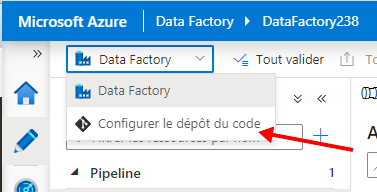
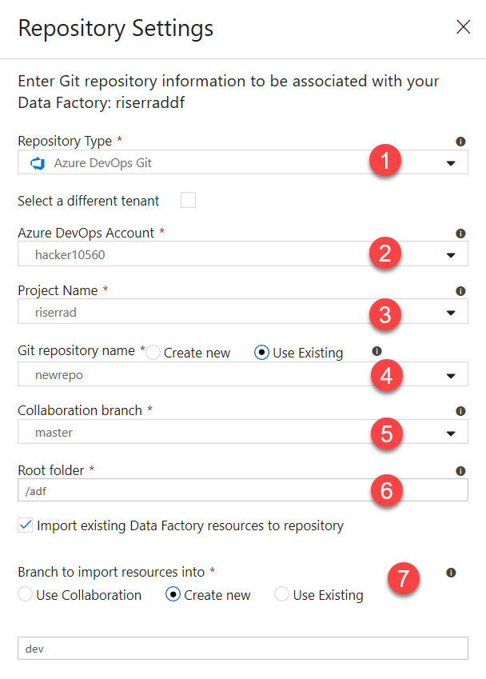
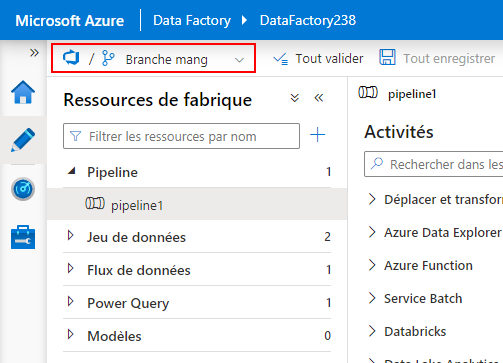
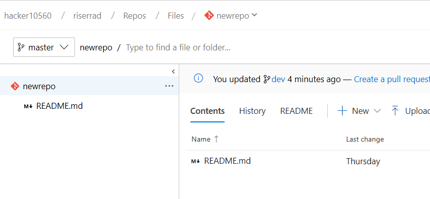

# Défi 03 - Extraction de données à partir de sources locales

Les objectifs de ce défi sont les suivants :

- Extraire les données de deux sources locales :
    - Une source de données CSV
    - Une base de données SQL Server
- Ensuite, une fois que vous avez tout configuré, configurer le contrôle de code source

## Extraction de données à partir de deux sources locales

Les fichiers CSV et la base de données SQL sont hébergés sur des machines virtuelles *locales* qui, pour l’objectif d’OpenHack, sont toutes des machines virtuelles Azure.

Pour pouvoir extraire des données de sources locales en utilisant Azure Data Factory, nous devons tirer parti des [runtimes d’intégration auto-hébergés](https://docs.microsoft.com/en-us/azure/data-factory/create-self-hosted-integration-runtime).

> *Le runtime d’intégration (IR) représente l’infrastructure de calcul utilisée par Azure Data Factory pour fournir des capacités d’intégration de données entre différents environnements réseau.*

Les étapes de base que vous devez effectuer pour copier les données de sources locales vers le cloud sont les suivantes :

- [Créer le runtime d’intégration auto-hébergé pour la source](challenge-03/creating-self-hosted-ir.md)
    - Vous devez répéter cette procédure pour chaque runtime d’intégration dont vous avez besoin pour ce défi (système de fichiers et instance locale de SQL Server)
    - Installer et configurer l’IR sur la machine virtuelle locale
- Créer le service lié qui doit utiliser ce runtime d’intégration
    - [Service lié de système de fichiers](challenge-03/creating-file-system-linked-service.md)
    - [Service lié d’instance SQL Server locale](challenge-03/creating-onprem-sql-server-linked-service.md)
- Créer le jeu de données
    - [Jeu de données pour les sources de système de fichiers](challenge-03/creating-file-system-dataset.md)
        - Pour le jeu de données récepteur de ce système de fichiers, vous pouvez créer un **[Jeu de données binaire](challenge-03/creating-sink-binary-dataset.md)** afin de copier les fichiers *en l’état*, car la machine locale n’a peut-être pas les [exigences](https://docs.microsoft.com/en-us/azure/data-factory/supported-file-formats-and-compression-codecs#parquet-format) nécessaires pour générer des fichiers Parquet.
    - [Jeu de données pour l’instance SQL Server locale](challenge-03/creating-onprem-sql-server-dataset.md)
        - Pour le jeu de données récepteur de cette instance SQL Server locale, vous pouvez utiliser le jeu de données récepteur **JSON** que vous avez créé pour copier le catalogue de films. C’est parce que la machine locale n’a peut-être pas les [exigences]([requirements](https://docs.microsoft.com/en-us/azure/data-factory/supported-file-formats-and-compression-codecs#parquet-format)) nécessaires pour générer des fichiers Parquet.
- Créer le pipeline
    - [Pipeline pour l’instance SQL Server locale](challenge-03/creating-onprem-sql-server-pipeline.md)
    - [Pipeline pour les sources de système de fichiers](challenge-03/creating-file-system-pipeline.md)

## Établissement du contrôle de code source

Azure Data Factory prend en charge l’intégration de Git à partir de son interface utilisateur. Cette intégration prend en charge GitHub ou Azure DevOps.

### Configuration de l’intégration d’Azure DevOps

> Si vous venez de recevoir l’autorisation d’utiliser le projet d’équipe ou le dépôt, vous devez y avoir accédé au moins une fois à partir de l’interface utilisateur web et avoir accepté les conditions avant de configurer cette intégration.

- Accédez à votre compte Azure DevOps et créez un projet d’équipe ou un dépôt à l’intérieur d’un projet d’équipe existant.
- Initialisez ce nouveau dépôt avec un fichier `.gitignore` ou `README.me`.
- Obtenez l’URL de clonage de ce dépôt et revenez à Azure Data Factory.
    - Par exemple : `https://johndoe@dev.azure.com/myazdoinstance/myteamproject/_git/myrepository`, où :
        - `johndoe` est votre nom d’utilisateur
        - `myazdoinstance` est le nom de l’organisation Azure DevOps
        - `myteamproject` est le nom du projet d’équipe
        - `myrepository` est le nom du dépôt
    - Si vous récupérez l’URL à partir de l’interface utilisateur d’Azure DevOps, cette URL est prête pour vous
- De retour sur Azure Data Factory, dans le bouton déroulant en haut à gauche, sélectionnez `Set up Code Repository`

- Dans la zone **Paramètres du dépôt** qui s’affiche à droite :

1. Sélectionnez `Azure DevOps`
2. Sélectionnez votre `Azure DevOps account`
3. Sélectionnez le `Team Project`
4. Choisissez si vous utilisez un **nouveau** dépôt Git ou un dépôt **existant**
5. Sélectionnez la `Collaboration branch`
    - Les **branches de collaboration** sont utiles pour permettre à Data Factory de savoir à partir de quelle branche vous voulez publier les objets. Si vous avez des objets enregistrés dans une autre branche, il ne les utilise pas.
6. Définissez le `Root folder`, qui est l’emplacement où se trouve tout le code dans lequel les objets Data Factory sont enregistrés, dans le dépôt Git
7. Comme vous avez déjà des objets Data Factory (services liés, jeux de données, etc.) configurés, vous pouvez importer leur code dans le contrôle de code source.
Pour ce faire, sélectionnez `Import existing Data Factory resources to repository`.
    - Sur `Branch to import resources into`, sélectionnez l’une des options suivantes :
        - Importer directement dans la branche `Collaboration`
        - `Create new` : créer une branche et y importer des ressources (recommandé)
            - Si vous créez une branche, veillez à lui donner un nom
        - `Use existing`, si vous avez déjà une branche pour le faire

Une fois que vous l’avez enregistrée, vous êtes invité à indiquer la branche à utiliser.
Sélectionnez la branche que vous venez de créer pour la voir en action :

Si vous basculez vers Azure DevOps, vous voyez que la branche `master` reste intacte :

Toutefois, vous remarquez également que la branche que vous avez créée (pour les besoins de ce guide, la branche `dev`) a tous les fichiers sous le répertoire `/adf` :

## Expériences d’apprentissage et blocages

## Commentaires potentiels

- Chaque fois que nous utilisons l’éditeur de fichier sur Azure Cloud Shell, la ligne de commande cesse de fonctionner. Nous devons recharger l’intégralité de la page pour qu’elle fonctionne à nouveau.
L’inconvénient est que, si vous avez défini des valeurs de variable, vous les perdez.
- Les lignes de commande PowerShell pour DataFactory pourraient avoir un modificateur `-Validate`, de sorte que le fichier de service lié/jeu de données/pipeline puisse être validé avant d’être créé sur DataFactory.
    - Aujourd’hui, le seul moyen de le faire est de l’envoyer pour création et, en cas d’échec, il fournit le bon message d’erreur, mais, en cas de réussite, il crée la ressource sur Data Factory. Qu’en est-il si je veux seulement valider mon fichier sans le créer tout de suite ?
- Si vous avez déjà une machine avec un IR auto-hébergé configuré et que vous voulez la reconfigurer pour qu’elle se connecte à un autre IR, il n’existe aucun document pour vous guider. C’est pourquoi j’ai créé le problème suivant :
    - [Besoin d’expliquer comment reconfigurer une installation d’IR auto-hébergé](https://github.com/MicrosoftDocs/azure-docs/issues/29819)
- Data Factory stocke les informations d’identification sous `encryptedCredential` dans le fichier JSON qu’il génère automatiquement. Ce serait bien s’il y avait de la documentation indiquant comment les générer pour que les personnes qui créent des jeux de données avec des fichiers JSON les stockent correctement, au lieu de créer des fichiers avec des informations d’identification brutes et de dépendre de Data Factory pour les convertir.
- En ce qui concerne les fonctions du module Az et de Data Factory V2, il doit exister un modèle pour nommer les ressources :
    - Pour la création de services liés, les tirets (`-`) sont autorisés
    - Pour la création de jeux de données, seuls les traits de soulignement (`_`) sont autorisés
    - Pour créer des runtimes d’intégration auto-hébergés, seuls les tirets (`-`) sont autorisés (`^[A-Za-z0-9]+(?:-[A-Za-z0-9]+)*$`)
- Parfois, pendant la configuration du dépôt de code sur ADF, après avoir sélectionné `Azure DevOps` et qu’il a commencé à charger les organisations, il commence à clignoter sur une boucle de rechargement de page. Ensuite, vous ne pouvez plus accéder à Data Factory.

### Runtime d’intégration auto-hébergé

- Pendant la création d’un service lié pour un IR de système de fichiers, l’une des propriétés est `properties:typeProperties:host`. À première vue, il s’agit apparemment du nom d’hôte de la machine, mais en réalité c’est le dossier que vous voulez partager.
Ce serait bien de renommer cette propriété.