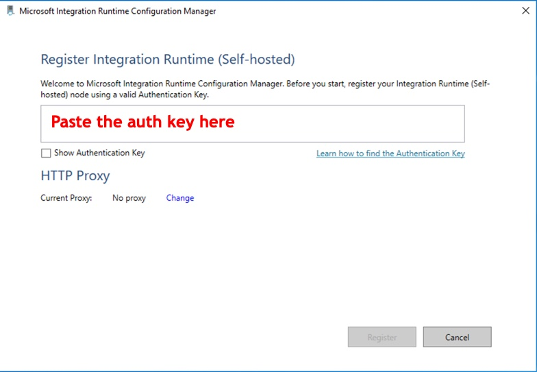

# <a name="creating-the-self-hosted-integration-runtime"></a>Création du runtime d’intégration auto-hébergé

## <a name="01---creating-the-self-hosted-integration-runtime-reference-on-data-factory"></a>01 - Création de la référence du runtime d’intégration auto-hébergé sur Data Factory

Utilisez la commande PowerShell ci-dessous pour créer la référence IR sur Data Factory :

```powershell
$dataFactoryName = "<data factory name>"
$resourceGroupName = "<resource group name>"
$selfHostedIntegrationRuntimeName = "<pipeline name>"
$selfHostedIntegrationRuntimeDescription = "<self-hosted IR description>"

Set-AzDataFactoryV2IntegrationRuntime `
    -ResourceGroupName $resourceGroupName `
    -DataFactoryName $dataFactoryName `
    -Name $selfHostedIntegrationRuntimeName `
    -Type SelfHosted `
    -Description $selfHostedIntegrationRuntimeDescription
```

## <a name="02---retrieve-the-self-hosted-ir-authentication-key"></a>02 - Récupérer la clé d’authentification de l’IR auto-hébergé

Vous avez besoin de cette clé pour installer et inscrire l’agent IR auto-hébergé sur la machine virtuelle. Pour ce faire, exécutez la commande PowerShell using suivante :

```powershell
Get-AzDataFactoryV2IntegrationRuntimeKey `
    -ResourceGroupName $resourceGroupName `
    -DataFactoryName $dataFactoryName `
    -Name $selfHostedIntegrationRuntimeName
```

Vous obtenez une sortie de ce type :

```powershell
AuthKey1    AuthKey2
--------    --------
<authkey1>  <authkey2>
```

Notez une de ces clés pour l’utiliser par la suite sur la machine virtuelle.

## <a name="03---download-install-and-register-the-self-hosted-ir-on-the-virtual-machine"></a>03 - Télécharger, installer et inscrire l’IR auto-hébergé sur la machine virtuelle

Une fois que vous avez créé l’IR et que vous avez la clé d’authentification, vous pouvez télécharger le programme d’installation sur la machine virtuelle et commencer à l’installer. Suivez [ce lien](https://www.microsoft.com/fr-fr/download/details.aspx?id=39717) pour accéder à la page de téléchargement.

Une fois l’installation effectuée, une fenêtre comme la suivante s’ouvre automatiquement :



Collez la clé d’authentification dans l’emplacement en surbrillance, puis cliquez sur *Inscrire*.
Cette action valide les paramètres d’inscription. Une fois que vous avez obtenu le message de réussite, cliquez sur *Terminer*.

Attendez la fin de l’inscription, puis cliquez sur *Lancer Configuration Manager* pour voir le *volet de contrôle* de l’IR auto-hébergé. Si vous voyez *« Connecté au service cloud (Data Factory v2) »* dans la barre d’état, votre IR auto-hébergé est correctement installé et configuré.