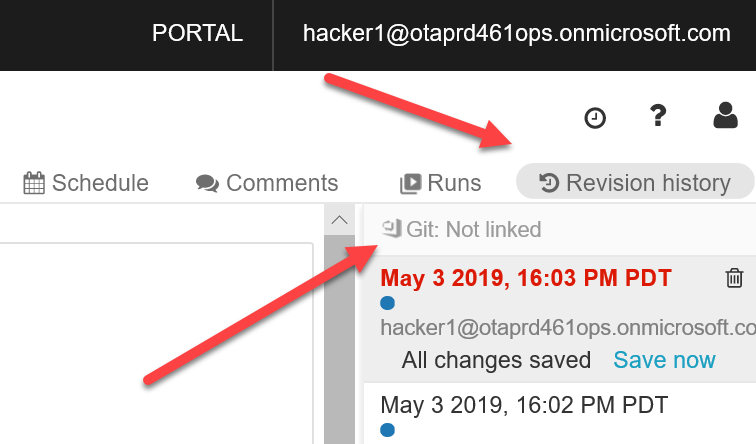
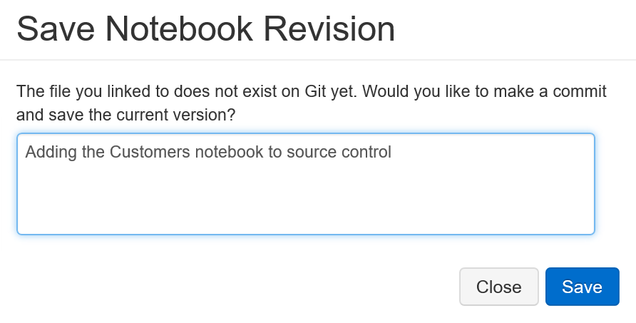

# Ajout des notebooks Databricks au contrôle de code source

Une fois que vous avez configuré la stratégie de branche sur votre dépôt Git Azure DevOps, vous l’utilisez pour versionner chaque notebook que vous créez. Pour ce faire, suivez [cette référence](https://docs.azuredatabricks.net/user-guide/notebooks/azure-devops-services-version-control.html) et ajoutez chacun de vos notebooks à un sous-dossier du dépôt (par ex., `/notebooks`) sur la branche de développement.

- Sur Azure DevOps, dans la vue du dépôt, cliquez sur le bouton `Clone` en haut à droite de l’écran. Le résultat suivant doit s’afficher :

- Revenez à Databricks et ouvrez le notebook à ajouter au contrôle de code source.
- Cliquez sur `Revision history` en haut à droite de la page

- Cliquez sur Git : non lié

- Dans ce nouvel écran :
    1. Sélectionnez `Link`
    2. Collez l’URL Git Clone que vous avez obtenue dans Azure DevOps
    3. Sélectionnez la branche `dev` que vous avez créée précédemment. Si vous ne pouvez pas la sélectionner, tapez `dev`, puis cliquez sur `Create new dev branch`
    4. Simplifiez le `Path in Git repo` suggéré par quelque chose du type `notebooks/<notebook name>.py`
    5. Cliquez sur `Save`

Une fois ces étapes effectuées, vous êtes invité à commenter la validation.
Faites-le, puis cliquez sur `Save`.

Chaque fois que vous voulez valider les changements que vous avez effectués dans un notebook, cliquez sur `Revision history`, puis sur `Save now` dans la dernière mise à jour de la liste.